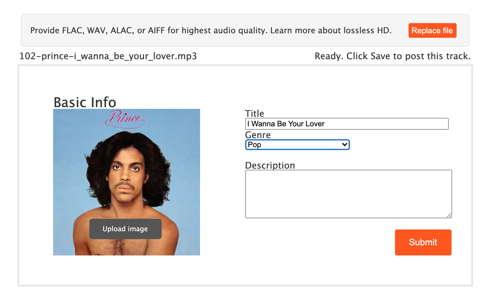
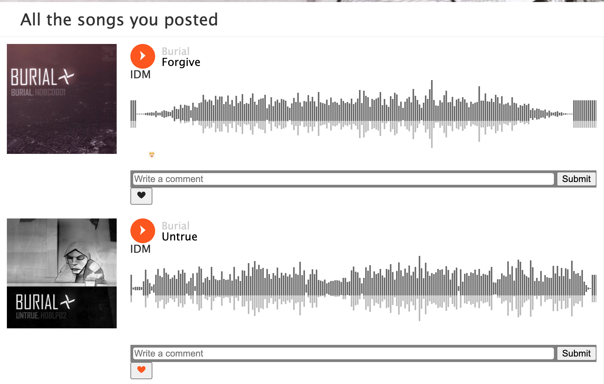

# Soundboard

SoundBoard is a single page, clone of SoundCloud built with Ruby on Rails, ReactJS, and Redux. Artists are able to upload songs for the world to stream, like, and comment on.


## Technologies used

SoundBoard is largely built with Ruby on Rails, PostgreSQL, React, Redux, and S3 to name a few

# Features

## Song Upload

User's can drag in and upload songs via a form in the top bar. Upon the loading of an audio file, SoundBoard will fill in relevant song metadata within form fields.



## Streaming

A large portion of SoundBoard's functionality comes from the user's ability to play music and navigate acrross the site, having music persisiting across each page. This is achieved by rendering a hidden audio element and updating it's current song prop whenever a user clicks on a track anywhere within the website.

```
  this.audio = new Audio(props.currentSong.songUrl)

      this.audio.onloadedmetadata = () => {
        this.setState({
          songDuration: this.audio.duration,s
        })
      }
```

## Song show

There are two ways in which songs are displayed across the site, in a grid and in the classic waveform style. Both can be seen on the discover and stream style respectively. User's can control the current song from both views.

Waveform components are being rendered with `wavebuilder.js`

Note: Heroku implementation not correctly rendering peaks. Local version posted below



# Future versions

- Proper filter and search
- More intelligent ID3 reading in song upload
- Follower/followee association
- Audio seeking in stream view affects main playhead
- Proper editing for users/songs
- Timed comments
- Carousel view in discover route
- Fix dead links
